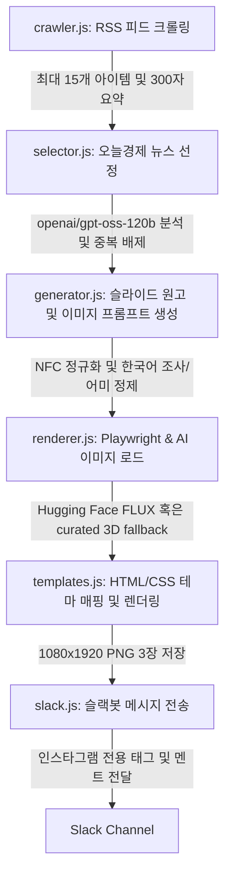

# 오늘경제 (Today's Economy) 프로젝트 브리프 📈

이 문서는 **오늘경제(Today's Economy)** 프로젝트의 목표, 직면했던 기술적 문제들과 그 해결 과정, 디자인 철학, 그리고 시스템 구조를 하나의 문서로 종합 정리한 **AI Agent 및 개발자용 가이드**입니다.

---

## 1. 프로젝트 개요 & 목표 (Overview & Goals)

### 1.1 개요
* **서비스명**: 오늘경제 (@today.econ)
* **목적**: 바쁜 현대인들과 재테크 초보자를 위해 매일경제 RSS 피드에서 가장 중요한 뉴스 1개를 엄선하고, 어려운 경제 용어를 친절하게 설명하여 매일 인스타그램 카드 뉴스 이미지(9:16 비율)와 본문 멘트를 자동 생성하는 파이프라인 시스템.
* **운영 비용**: **0원 (무료)** - 인프라 및 API 사용료가 전혀 들지 않는 지속 가능한 구조.

### 1.2 핵심 목표
1. **AI 양산형 느낌 제거 (Premium Visual Editorial)**:
   * 템플릿 색상, 배경 이미지, 줄간격, 타이포그래피 여백 등을 정밀하게 조율하여 "AI가 대충 찍어낸 전형적인 양산형 콘텐츠"의 인상을 완전히 제거하고 프리미엄 경제 에디토리얼 브랜드 감성을 확보한다.
2. **슬라이드 내 중복 배제 (Slide-level Redundancy Control)**:
   * 다른 슬라이드 간의 단어 반복은 자연스러운 맥락 연결이므로 허용하되, **동일한 슬라이드 내부(하나의 카드)**에서 불릿 포인트들끼리 핵심 키워드가 과도하게 겹치는 현상을 방지하여 세련된 흐름을 만든다.
3. **가독성 최적화 (Readable & Natural Text)**:
   * 너무 짧은 축약으로 의미 전달이 누락되지 않도록, 자연스러운 서술형(문장형) 문구(~다, ~요 등)를 허용하며, 슬라이드당 텍스트 분량을 과도하게 줄이지 않고 충분한 정보(문맥)가 전달되게 한다.
4. **쉬운 지식 전달 및 용어 해설 영역 마련**:
   * 어려운 경제 용어는 별도로 추출하여 슬라이드 하단이나 별도의 공간(Insight 영역 등)에 풀이와 비유를 제공하여 초보자의 이해를 돕는다.
5. **마지막 슬라이드 균형 (Predictions & 1 Action Item)**:
   * 마지막 장(액션 카드)에서 과도한 투자 조언이나 억지스러운 행동 지침만 나열하지 않는다. 3개의 불릿 중 앞의 2개는 '예측 및 동향'을 서술하고, 마지막 1개에만 가벼운 '실천적 액션 아이템'을 배치하여 균형을 맞춘다.

---

## 2. 디자인 시스템 및 테마 가이드 (Design System)

카드 뉴스는 주제의 성격에 따라 3가지 테마 중 하나를 자동으로 선택하여 9:16 세로형(1080x1920) 이미지로 Playwright를 통해 렌더링됩니다.

| 테마명 (Theme) | 어울리는 주제 | 주조색 (Accent Color) | 비주얼 톤앤매너 |
| :--- | :--- | :--- | :--- |
| **Obsidian** | 전통 거시경제, 금리, 기업 실적, 증시 시황 | `#00d2ff` (네온 블루) | 신뢰감 있고 묵직한 다크 모드 |
| **Ivory** | 민생 경제, 복지, 부동산, 일반 소비재 | `#705d00` (짙은 골드) | 세련되고 따뜻한 웜 샌드 톤 |
| **Cyber** | 반도체, IT, 빅테크, AI, 가상자산 | `#bc13fe` (네온 퍼플) | 미래지향적이고 트렌디한 테크 감성 |

### 디자인 디테일 정책
* **배경 이미지 (AI Generation)**: 기사 맥락에 맞는 AI 생성 이미지(예: pollination.ai 등)를 적극 활용한다. 단순히 추상적인 배경보다는 문맥과 연관된 이미지를 생성하되, 퀄리티 확보를 위해 고품질 프롬프트를 적용한다 (단, 조잡한 클립아트나 텍스트가 렌더링된 이미지는 피한다).
* **불릿 아이콘**: 단순한 체크마크나 빈 동그라미를 지양하고, 테마 색상과 어우러지는 커스텀 SVG 마커를 적용한다 (예: Ivory 테마의 팩트 카드는 골드 원형 마커, 액션 카드는 웜 테라코타 주황 오렌지색 `#c2410c` 체크마크).
* **타이포그래피**: 한글 전용 고품질 서체인 **Pretendard**를 웹 폰트로 연동하며, 타이틀과 본문 간의 여백(Margin) 및 행간(Line-height)을 디바이스 크기에 상관없이 최적의 비율로 유지한다.

---

## 3. 기술적 고민과 문제 해결 이력 (Struggles & Solutions)

### 3.1 LLM 모델 선택 및 비교
* **후보**: `openai/gpt-oss-120b` vs `llama-3.3-70b-versatile` (Groq 제공)
* **결정**: **openai/gpt-oss-120b** 모델을 메인으로 사용합니다. 이 모델은 하루 허용량(TPD)이 더 넉넉하며, 복잡한 지문 요약 및 한국어 경제 용어 처리에 우수합니다. JSON Mode의 안정적인 출력을 위해 `max_tokens` 설정을 selector 단계는 1000, generator 단계는 3000으로 충분히 할당하여 사용합니다.

### 3.2 Groq API Rate Limit (429 및 413 에러) 대응
무료 API 키의 특성상 낮은 TPM(Tokens Per Minute)과 RPM(Requests Per Minute) 제한으로 인해 장애가 빈번히 발생했습니다.
* **에러 원인**:
  1. 뉴스 크롤러가 수집한 뉴스 원본 데이터와 프롬프트 길이가 너무 길어 fallback 모델(`llama-3.1-8b-instant`, TPM 한도 6,000)을 호출할 때 **413 Payload Too Large** 에러 발생.
  2. 동시 호출로 인한 **429 Rate Limit Exceeded** 발생.
* **해결 조치**:
  * **크롤러 한도 설정**: 수집 항목 수를 최대 15개로 슬라이싱하고, 각 뉴스 요약문을 최대 300자로 단축하여 입력 토큰 양을 원천 차단.
  * **NFC 정규화**: Mac OS 환경에서 복사된 코드 파일 내 한글 텍스트가 NFD(자음/모음 분리) 상태로 저장되어 LLM 토크나이저에서 토큰 수가 3~5배 부풀려지는 현상 발견. API 요청 직전에 모든 프롬프트 스트링에 `.normalize('NFC')`를 실행하여 토큰 사용량을 70% 이상 절감.
  * **지수 백오프 기반 재시도 루프 (`callGroqWithRetry`)**: 429 에러 감지 시 초기 대기 시간을 8,000ms로 늘리고 배수를 2.0으로 상향(8s ➡️ 16s ➡️ 32s ➡️ 64s)하여 sliding window 해제 시간을 안정적으로 보장.

### 3.3 비활성화된(Decommissioned) 모델 이슈
* **해결**: 지원 중단된 모델을 전면 제거하고 메인 추론 모델로 `openai/gpt-oss-120b`, 그리고 fallback 모델로 `llama-3.1-8b-instant`를 사용하도록 정비하였습니다.

### 3.4 Tailwind 글자 크기 버그
* **문제**: 모바일 뷰포트에서 타이틀과 슬라이드 제목의 글자 크기가 지정되지 않아 tiny 폰트로 렌더링되는 현상.
* **해결**: `templates.js` 내의 인라인 Tailwind 테마 설정에 커스텀 크기인 `text-2.5xl`과 `text-3.5xl`을 수치(font-size, line-height)와 함께 올바르게 정의하여 가독성을 원천적으로 회복.

### 3.5 1차원적인 이미지 매칭과 404 폴백 오류
* **문제**: '실손보험 적자' 기사임에도 달러 지폐나 VR 게임기 같은 연관성 없는 사진이 배경에 배치되거나, 특정 Unsplash 주소가 404를 반환하며 크래시 발생.
* **해결**:
  * FLUX 이미지 생성 실패 시 사용되는 Unsplash 테마별 폴백 이미지 리스트를 수작업으로 검수된 '추상적인 3D 유체 웨이브(3D abstract fluid wave)' 이미지로 전면 교체.
  * 404 에러를 내던 잘못된 이미지 주소를 유효한 웜 그라데이션 및 추상 3D 이미지 주소로 긴급 수정.

---

## 4. 시스템 구조 및 실행 흐름 (Architecture)

1. **`src/crawler.js`**: 매일경제 경제 RSS를 읽어와 데이터를 구조화하고 요약 길이를 300자로 컷팅합니다.
2. **`src/selector.js`**: 최근 발행 기록인 `history.json`을 읽고 중복되지 않으면서 가장 중요한 파급력을 가진 뉴스 인덱스를 선정합니다.
3. **`src/generator.js`**: 선정된 뉴스를 바탕으로 슬라이드 3개 분량의 텍스트, 이미지 생성 프롬프트, 그리고 인스타그램 본문 멘트를 만듭니다. 여기서 문장형 서술을 유지하면서, **어려운 용어의 별도 설명 공간 마련**, 슬라이드 내 불릿 간 중복 검사, 그리고 마지막 슬라이드의 구조(예측 2 + 액션 1)를 LLM 프롬프트를 통해 유도합니다.
4. **`src/renderer.js`**: 생성된 프롬프트를 FLUX API에 전달하여 일러스트를 받고, Playwright를 실행하여 HTML을 로딩한 후 세로형 PNG 3장(`slide_1.png` ~ `slide_3.png`)을 파일로 굽습니다.
5. **`src/slack.js`**: 결과물 사진들과 복사 가능한 텍스트 캡션을 지정된 슬랙 채널로 발송합니다.
6. **`src/index.js`**: 전체 워크플로우를 관장하는 메인 컨트롤러입니다.

---

## 5. 미래의 에이전트/개발자를 위한 약속 (Guidelines for Future Agents)

1. **한글 텍스트는 항상 `.normalize('NFC')`를 적용할 것**: Mac OS 환경에서 텍스트 수정을 하거나 프롬프트를 합칠 때 NFD 분리 현상이 생겨 토큰 폭탄이 발생할 수 있습니다.
2. **템플릿 디자인 수정 시 Tailwind Config 확인**: 카드 내 글자 크기나 여백을 변경할 때는 반드시 `templates.js` 상단의 테마 연동 영역에 커스텀 크기(`text-2.5xl`, `text-3.5xl` 등)가 등록되어 있는지 검증하십시오.
3. **Ivory 테마 색상 주의**: 테마 지정 시 임의의 녹색이나 원색을 쓰지 마십시오. 골드 `#705d00` 계열과 포인트 액션용 오렌지 테라코타 `#c2410c`만을 사용하여 조화롭고 차분한 느낌을 줘야 합니다.
4. **문장형 서술의 자연스러움 유지**: 짧은 명사형 축약으로 문맥이 유실되는 것보다, 서술형(문장형)으로 충분한 정보를 전달하는 것을 우선시하십시오.
5. **마지막 카드(Action)의 템플릿**: 무리한 행동 지침(Action Item)으로만 채우지 마십시오. "동향/예측 2개 + 가벼운 액션 아이템 1개"의 구성을 기본으로 합니다.
